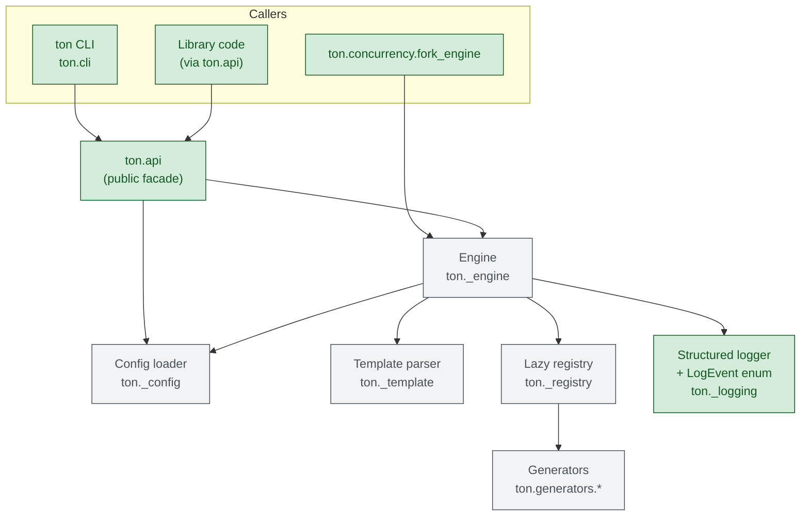
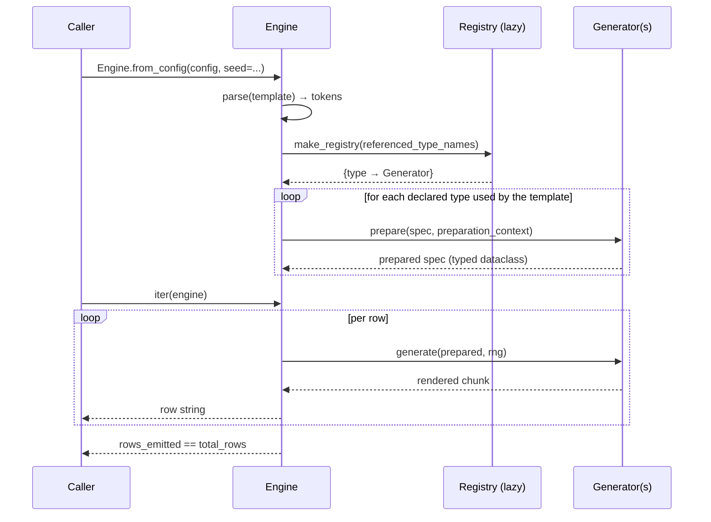

# TON

> Mass data generator: synthesize structured test data from a JSON template.

TON renders rows of structured text from a small JSON description. It is useful when you need a few million lines of plausible-looking CSV, TSV, log records, or fixtures and you do not want to glue together a one-off Python script every time.

## Install

```bash
pip install -e .
```

Python 3.12 or newer. TON has zero runtime dependencies.

## Run without installing

TON has no third-party runtime requirements, so from a checkout you can invoke it straight from the repo root:

```bash
# from the repo root, no pip install needed
python -m ton examples/hwmetrics.json
```

The current directory is on `sys.path` automatically, so Python finds the `ton/` package without `pip install`. Run from somewhere else by pointing `PYTHONPATH` at the checkout:

```bash
PYTHONPATH=/path/to/ton python -m ton /path/to/config.json
```

Every flag described below works the same way in module form.

## Usage

```bash
ton examples/hwmetrics.json
```

Pin the RNG for reproducible output:

```bash
ton examples/hwmetrics.json --seed 42
```

Stream to a file (avoids buffering in your shell):

```bash
ton examples/hwmetrics.json -o hwmetrics.csv
```

### Flags

| flag                   | description                                                                          |
|------------------------|--------------------------------------------------------------------------------------|
| `--seed <int>`         | Seed the RNG for reproducible output.                                                |
| `-o`, `--output PATH`  | Write rows to a file instead of stdout. Accepts a regular file or a FIFO; refuses other targets (`/dev/*`, …). |
| `--no-clobber`         | Fail instead of overwriting an existing `--output` or `--proof-report` file.          |
| `--resume-from N`      | Generate and discard the first `N` rows before writing output (paired with `--seed`). |
| `--validate`           | Validate the config and exit without generating rows.                                |
| `--batch-rows N`       | Flush output every N written rows (default `1024`).                                  |
| `--progress N`         | Emit a JSON progress line on stderr every `N` rows (also surfaces a logger event).   |
| `--verbose`            | Print final row count, elapsed time, and rows/sec to stderr.                         |
| `--log-level LEVEL`    | Attach a stderr handler to the `ton` logger (`debug`/`info`/`warning`/`error`/`critical`). |
| `--proof-check MODE`   | Proof-check generated values: `off`, `sample`, `all`, or `audit` (collect, don't abort). |
| `--proof-sample-rate N`| With `--proof-check sample`, check every `N`th generated row.                        |
| `--proof-report PATH`  | With audit mode, stream every failure as UTF-8 JSON Lines to `PATH`.                 |
| `--redact-proof-failures` | Mask values, paired ids, reasons, and field specs in proof diagnostics and reports. |
| `--list-namespaces`    | List available namespaces, data types, transforms, and validators, then exit.        |
| `--entry-points`       | Load trusted third-party plugins from the `ton.generators`, `ton.transforms`, and `ton.validators` entry-point groups. |
| `--entry-point GROUP:DISTRIBUTION:NAME` | Allow only this exact trusted entry-point provider; repeat for multiple providers. |
| `--version`            | Print the package version.                                                           |

With `--proof-check audit` the run still exits `0`; the failure count is printed
to stderr (`ton: proof-check audit: …`). Add `--proof-report PATH` for
diagnostic values/specs. Each failure also emits a value-free
`proof_check_failed` log event (see `--log-level warning`).

Everything observability-related goes to stderr; stdout stays clean for piping. Exit codes: `0` success, `1` missing config / output error / refused special-file target, `2` invalid config or unknown variable, `3` unexpected error — including a generator, transform, validator, or proof hook raising during generation — `130` interrupted (Ctrl-C).

### Partition a long run across processes

```python
import shutil
from multiprocessing import get_context
from pathlib import Path
from tempfile import TemporaryDirectory

from ton import api


def write_worker(task):
    config, path, parent_seed, worker_id, workers, encoding = task
    return api.write_shard(
        config,
        path,
        parent_seed=parent_seed,
        worker_id=worker_id,
        workers=workers,
        encoding=encoding,
    )


if __name__ == "__main__":
    config = api.load_config("huge.json")
    workers = 3
    encoding = api.output_encoding(config)
    with TemporaryDirectory(prefix="ton-shards-") as directory:
        shards = [Path(directory) / f"part-{worker_id}.txt" for worker_id in range(workers)]
        tasks = [
            (config, str(path), 1, worker_id, workers, encoding)
            for worker_id, path in enumerate(shards)
        ]
        with get_context("spawn").Pool(workers) as pool:
            counts = pool.map(write_worker, tasks)

        with api.open_output_path("combined.txt", encoding=encoding) as output:
            for path in shards:
                with path.open("r", encoding=encoding, newline="") as shard:
                    shutil.copyfileobj(shard, output)

        assert sum(counts) == config["rows"]
```

Each shard receives an exact, non-overlapping row count and a deterministic
worker RNG. Workers write atomically to separate files, so no worker accumulates
its output in memory. The parent merges shards in worker-id order to preserve
partition order. `TemporaryDirectory` removes completed shards and any
worker-temporary files after success or failure; the final merged file is also
published atomically.

`--resume-from` is for restarting one seeded stream: it still generates the
skipped prefix and does not limit the number of later rows.

## Architecture

For a deeper description of namespaced registrations, transform preparation,
proof checking, and configuration schemas, see [docs/architecture.md](docs/architecture.md).



Row-generation request flow:

Rows have no implicit width ceiling. Set the optional top-level `maxRowWidth`
positive integer when an operator-controlled guard is required. The limit
covers the complete rendered row—literals and all placeholders—and raises
`TemplateError` before the row is yielded or written.



Key pieces:

- **`ton.api`** is the only stable public surface. Everything with a single leading underscore (`ton._engine`, `ton._template`, `ton._registry`, `ton._config`, `ton._logging`) is private and may change between releases.
- **`Engine`** owns the row hot path. Template tokens are precomputed into literal segments at construction time, so each row is a string-join with no per-row regex work.
- **`Registry`** instantiates only the generator classes the template actually references (composite specs are walked recursively to pick up nested types). The set of built-ins is fixed by an explicit allowlist; third parties extend via the `ton.generators` entry-point group.
- **`LogEvent`** is a typed enum (`engine_constructed`, `engine_progress`, `entry_point_failed`, …) so downstream consumers can `match LogEvent(record.event)` instead of string-comparing.

## Library use

```python
from ton import api

# One-shot, deterministic:
rows = list(api.generate_from_file("examples/dna.json", seed=42))

# Streaming form for large outputs. Rows carry no line terminator, so a
# text sink needs one -- writing the bare row concatenates every record:
for row in api.generate(config_dict, seed=42):
    sink.write(f"{row}\n")

# Exceptions, Engine, and the LogEvent enum are all re-exported:
try:
    rows = list(api.generate(bad_config))
except (api.ConfigError, api.TemplateError, api.OutputEncodingError) as exc:
    ...  # the config is invalid, or a value could not be encoded
except api.PipelineStageError as exc:
    ...  # a generator/transform/validator/proof hook raised at row time
```

For finer control, construct an `Engine` directly:

```python
from ton import api

engine = api.Engine.from_file("examples/dna.json", seed=42)
print(engine.total_rows, engine.rows_emitted)   # 10, 0
for row in engine:
    ...
print(engine.rows_emitted)                       # 10

# Or with an in-memory config + custom registry / milestone:
engine = api.Engine.from_config(
    config_dict,
    seed=42,
    milestone_rows=100_000,   # emits engine_milestone log events
)
```

An `Engine` is single-shot: iterate it once, then construct a new Engine for
another pass. This gives the RNG, proof checker, and stateful generators such
as `sequence` one unambiguous lifecycle. Calling `api.generate(...)` again
constructs a fresh Engine and reproduces seeded output.

Public configuration helpers:

- `validate_config(config, *, catalog=None) -> None` validates structure,
  references, extension-owned keys, and prepared generator specs. It raises
  `ConfigError` on invalid input and returns `None` on success.
- `output_encoding(config) -> str` returns the configured top-level encoding,
  or `"utf-8"` when omitted.
- `normalize_reference(reference) -> str` qualifies bare extension names with
  `core.` and preserves qualified names. Invalid identifiers raise
  `RegistryError`.

Public extension and provenance types:

- `RegistryError` reports invalid, duplicate, or ambiguous extension
  registrations.
- `Transform` and `Validator` are runtime-checkable protocols for post-source
  processing and final-value checks.
- `Engine.provenance` returns immutable `ProvenanceRecord` entries containing
  each field's source type, transform chain, proof settings/failure count, and
  plugin package/version when available.
- `ProofFailure` is the immutable audit record delivered to the public
  `ProofFailureSink` callback type.

`OutputEncodingError` is the public output-domain error for a value that a
configured text codec cannot represent. Its `encoding` attribute names the
codec, `field_name` identifies the source field when known (otherwise `None`
for a rendered row), and the message includes the codec failure reason.

`generate(config, *, seed=None, registry=None, transforms=None,
validators=None, proof_mode="off", proof_sample_rate=1,
milestone_rows=0, redact_proof_failures=False, proof_failure_sink=None)` and `generate_from_file`
accept the same generation options. For example:

```python
catalog = api.build_extension_catalog()
rows = api.generate_from_file(
    "config.json",
    seed=42,
    validators=catalog.validators(),
    proof_mode="sample",
    proof_sample_rate=100,
    redact_proof_failures=True,
)
```

`proof_mode` is `off`, `sample`, `all`, or `audit`; sample mode checks every
Nth row. Redaction removes values, plugin-controlled reasons, and specs from
strict failure diagnostics, retained audit failures, and CLI proof reports.
Structured logs always omit generated values, specs, and proof reasons. Redaction
can be used with `sample` or `all` without creating a proof report and does not
alter generated rows.

Custom plugins register via three entry-point groups in any installed package: `ton.generators` (data types), `ton.transforms`, and `ton.validators`:

Generator extensions implement `prepare(spec, context)` and `generate(prepared, rng)`.
Preparation runs once per engine. Composite generators resolve children with
`context.prepare_child(parent_type, location, child_spec)` and declare their owned
child locations with `nested_specs(spec)`. Discovery reads only these declarations;
ordinary plugin metadata remains opaque. Each location is a tuple of literal mapping keys
and list indices, for example
`("choices", 0, "spec")` or `("dotted.key",)`. Pass the same tuple to `prepare_child`.

A composite generator using the public API:

```python
from ton import api

class BracketGenerator(api.Generator):
    type_name = "bracket"
    config_keys = frozenset({"spec"})

    def nested_specs(self, spec):
        return ((("spec",), spec["spec"]),)

    def prepare(self, spec, context=None):
        return context.prepare_child(self.type_name, ("spec",), spec["spec"])

    def generate(self, prepared, rng):
        child, child_spec = prepared
        return f"[{child.generate(child_spec, rng)}]"

registry = api.build_extension_catalog().generators()
registry["example.bracket"] = BracketGenerator()
config = {"rows": 2, "format": "$x$", "types": {
    "x": {"type": "example.bracket", "spec": {"type": "string", "values": ["x"]}}
}}
rows = list(api.generate(config, registry=registry, seed=1))
assert rows == ["[x]", "[x]"]
```

```toml
[project.entry-points."ton.generators"]
my_type = "my_pkg.generators:MyGenerator"

[project.entry-points."ton.transforms"]
"my_ns.my_transform" = "my_pkg.transforms:MyTransform"
```

`build_extension_catalog` is the canonical loading API; it returns a namespaced `ExtensionCatalog` exposing `generators()`, `transforms()`, and `validators()`:

```python
catalog = api.build_extension_catalog(include_entry_points=True)
snapshot = catalog.snapshot()
for row in api.generate(config_dict,
                        registry=snapshot.generators,
                        transforms=snapshot.transforms,
                        validators=snapshot.validators):
    ...
```

`ExtensionCatalog` treats registered generator instances as prototypes. Each
`catalog.generators()` call returns fresh deep-copied instances, so reusing a
catalog across Engines does not share generator state. Engine construction also
copies supplied registry, transform, and validator mappings together, so reusing
an `EngineOptions` or registry mapping is safe. Read-only mapping containers are
accepted; registered aliases and shared dependencies stay shared within one
Engine. Supplied plugin instances remain unchanged. Generator attributes
must therefore support `copy.deepcopy`. Use `catalog.snapshot()` when combining
generators, transforms, and validators: it clones all three kinds atomically and
preserves dependencies shared between them within that snapshot.

Plugins implement their protocols entirely against `ton.api`: alongside `Generator`
and `PairedGenerator`, the facade exports the contract types a transform, validator,
or proof hook has to name — `PreparationContext`, `TransformResult`, `TransformProof`,
`TransformCapabilities`, and `ProofResult`. No private module import is required.

A broken plugin discovered through broad `--entry-points` loading is isolated:
failures are logged as `entry_point_failed` and skipped, so one bad package does
not abort the catalog build. Duplicate providers for the same group and
entry-point name are rejected before plugin code loads.
Entry points execute installed package code while loading, so TON loads them only when explicitly requested, either through `api.build_extension_catalog(include_entry_points=True)` or the CLI `--entry-points` flag. To load only named providers, pass exact `GROUP:DISTRIBUTION:NAME` selectors through `allowed_entry_points` or repeat the CLI `--entry-point GROUP:DISTRIBUTION:NAME` option. Every exact selector must be installed and load successfully; missing, duplicate, or broken selected providers raise `RegistryError` and make the CLI exit `2`. Distribution names are normalized case-insensitively across `.`, `_`, and `-`; name-only allowlists are rejected.

Parallel runs use the public `ton.concurrency` helpers re-exported by `ton.api`.
`write_shard` is the bounded-memory process-pool primitive used in the complete
merge/cleanup recipe above. Callers with their own streaming sink can instead
construct one worker engine directly:

```python
from ton import api, concurrency

config = api.load_config("examples/dna.json")
workers = 3
worker_id = 0
eng = concurrency.fork_engine(
    config,
    parent_seed=42,
    worker_id=worker_id,
    workers=workers,
    rows=concurrency.chunk_rows(config["rows"], workers, worker_id),
)
for row in eng:
    ...
```

Each worker derives its RNG from `BLAKE2b(parent_seed, worker_id)` so adjacent workers do not see correlated streams. An `engine_forked` log event is emitted with `worker_id` / `parent_seed` so multi-process runs stay distinguishable in the structured log stream.

## Config format

```json
{
  "encoding": "UTF-8",
  "rows": 10,
  "format": "$timestamp$;$cpu_type$;$cpu_usage$",
  "types": {
    "timestamp": {"type": "date",    "minValue": "1100-01-01", "maxValue": "2050-12-31", "format": "%Y-%m-%d %H:%M:%S"},
    "cpu_type":  {"type": "string",  "values": ["AMD", "Intel", "ARM"]},
    "cpu_usage": {"type": "decimal", "minValue": 0.0, "maxValue": 100.0, "decimals": 2, "padWithZero": false}
  }
}
```

- `rows` — how many rows to emit (non-negative integer; no fixed maximum).
- `format` — the template; any `$name$` segment is a variable that must be declared in `types`. `$$` renders a literal `$`. A trailing `[id]` (e.g. `$word[id]$`) requests the paired-id facet of a paired generator — see [Paired references](#paired-references-nameid) below.
- `types` — a map of variable name to type spec.
- `encoding` — optional; the text codec used for file output and stdout (default `utf-8`). Must be a text codec Python recognizes; stdout is temporarily reconfigured for the run and restored afterward.
- A value that the configured codec cannot represent is an output error (CLI exit `1`), not a configuration error.

Unknown root keys and unknown keys owned by built-in generators/transforms are
rejected, including inside nested composite specs. Diagnostics include the full
config path and a suggestion for close typos. Plugin generators keep an open
key namespace unless they declare `config_keys`; existing plugin-specific
options therefore remain compatible.

### Type reference

Twenty-two built-in types. Every output below was produced with `--seed 1` on a 4-row config of the form `{"rows": 4, "format": "$x$", "types": {"x": <spec>}}` so the examples are byte-reproducible.

#### `boolean`

Pick one of two literals with equal probability.

| field        | type   | description              |
|--------------|--------|--------------------------|
| `whenTrue`   | string | rendered when "true"     |
| `whenFalse`  | string | rendered when "false"    |

```json
{"type": "boolean", "whenTrue": "Y", "whenFalse": "N"}
```

```
Y
Y
N
Y
```

#### `integer`

Uniform integer in `[minValue, maxValue]`, optionally zero-padded. Padding width spans the wider of the min/max rendering (so negative values line up with positives).

| field         | type    | description                           |
|---------------|---------|---------------------------------------|
| `minValue`    | int     | inclusive lower bound                 |
| `maxValue`    | int     | inclusive upper bound (>= `minValue`) |
| `padWithZero` | bool    | left-pad to a fixed width             |

```json
{"type": "integer", "minValue": 1, "maxValue": 9999, "padWithZero": true}
```

```
2202
9326
1034
4180
```

Unpadded with negatives:

```json
{"type": "integer", "minValue": -100, "maxValue": 100, "padWithZero": false}
```

```
-66
45
95
-84
```

#### `decimal`

Uniform fixed-point value in `[minValue, maxValue]`, formatted to exactly `decimals` digits
after the decimal point. TON draws uniformly from the representable values at that scale —
every emitted value is one of them, so no rounding moves a draw outside the bounds. A range
containing no representable value (for example `0.01`–`0.02` with `decimals: 1`) is rejected
during preparation rather than silently widened.

| field         | type    | description                                  |
|---------------|---------|----------------------------------------------|
| `minValue`    | number  | inclusive lower bound                        |
| `maxValue`    | number  | inclusive upper bound (>= `minValue`)        |
| `decimals`    | int     | digits after the decimal point (>= 0)        |
| `padWithZero` | bool    | left-pad to a fixed width including sign + dot |

```json
{"type": "decimal", "minValue": 0.0, "maxValue": 100.0, "decimals": 2, "padWithZero": false}
```

```
22.01
93.25
10.33
41.79
```

#### `char`

Concatenate `maxChar` random picks from `values` (with replacement).

| field      | type      | description                              |
|------------|-----------|------------------------------------------|
| `values`   | string[]  | non-empty pool; entries may be longer than one character |
| `maxChar`  | int       | number of draws (N ≥ 1), not output length |

`maxChar` counts draws, so the output is `maxChar` characters only when every
pool entry is a single character. With `{"values": ["ab"], "maxChar": 2}` each
row is `abab` — two draws of a two-character entry.

```json
{"type": "char", "values": ["A", "C", "G", "T"], "maxChar": 6}
```

```
ATTCCC
GTAATC
TACGAT
TAAGTC
```

#### `string`

Pick one literal uniformly from `values`.

| field    | type     | description           |
|----------|----------|-----------------------|
| `values` | string[] | non-empty literal pool |

```json
{"type": "string", "values": ["Intel", "AMD", "ARM"]}
```

```
Intel
ARM
Intel
AMD
```

#### `weighted`

Sampling uses exact proportional weights and integer draws. Finite decimal weights
retain their ratios at any magnitude; zero-weight choices are never selected.

Pick one alternative with probability proportional to its effective weight.
Omitted `weight` defaults to `1.0`. Sampling is uniform (1/N per entry) when
all effective weights are equal.

For example, the omitted weight below is 1, so `rare` has probability 1/10
and `common` has probability 9/10:

```json
{"type": "weighted", "choices": [
  {"weight": 9, "spec": {"type": "string", "values": ["common"]}},
  {"spec": {"type": "string", "values": ["rare"]}}
]}
```

Any registered generator can be weighted, not just literal strings:

| field     | type     | description                                                       |
|-----------|----------|-------------------------------------------------------------------|
| `choices` | object[] | each entry is `{"weight": number?, "spec": <type spec>}` — `weight` defaults to `1.0` when omitted |

```json
{"type": "weighted",
 "choices": [
   {"weight": 70, "spec": {"type": "string", "values": ["common"]}},
   {"weight": 30, "spec": {"type": "integer", "minValue": 0,
                            "maxValue": 99, "padWithZero": false}}
 ]}
```

```
common
common
97
60
```

Composite `choices` may themselves nest `weighted` / `oneOf` / `sequence_of`. Paired generators (`hash`) cannot be used as a composite child — the `[id]` half would be unreachable from outside the wrapper, so the engine rejects such configs at construction time.
Choice wrappers accept only `weight` and `spec`; misspelled or extra keys are
rejected with an indexed configuration path and a suggestion when available.

#### Transform chains

Type specs may include an ordered `transforms` list. Legacy specs such as
`{"type": "integer"}` still work; built-ins can also be referenced with the
explicit `core.` namespace, for example `{"type": "core.integer"}`.

Type specs may also include a `validators` list of validator references.
Validators run after source generation and transforms. The built-in
`non_empty` validator rejects empty strings; plugins may add namespaced
validators such as `plugin.check`:

```json
{"type": "string", "values": ["ok"], "validators": ["non_empty"]}
```

The built-in `distribution` transform chooses among two or more prepared
candidate type specs. It is a source-independent first stage: TON does not
draw the field's nominal source before selecting a candidate.

```json
{
  "type": "string",
  "values": ["not drawn"],
  "transforms": [
    {
      "type": "distribution",
      "choices": [
        {"weight": 80, "spec": {"type": "string", "values": ["common"]}},
        {"weight": 20, "spec": {"type": "integer", "minValue": 1, "maxValue": 9}}
      ]
    }
  ]
}
```

The built-in `identity` transform is an explicit no-op. It returns generated
values unchanged and preserves paired values, so it is mainly useful when a
config or test needs a transform step without changing output.

Plugins register namespaced data types and transforms through the public
catalog API or trusted entry points. A plugin-provided type can be referenced
with its qualified name:

```json
{"type": "acme.customer_id", "prefix": "CUST"}
```

Load installed plugin entry points explicitly:

```bash
ton config.json --entry-points --list-namespaces
```

Proof checking can validate generated values during a run:

```bash
ton config.json --proof-check sample --proof-sample-rate 1000
ton config.json --proof-check all
ton config.json --proof-check audit --proof-report proof-audit.jsonl
ton config.json --proof-check audit --proof-report safe-audit.jsonl \
  --redact-proof-failures
```

Strict modes (`sample` and `all`) stop on the first proof failure with row,
field, stage, and reason. Audit mode keeps generating rows and records proof
failures for library callers via `Engine.proof_failures`.

Proof reports are UTF-8 JSON Lines with one `ton.proof-audit/v2` object per
failure. Each object contains `row`, `type_key`, `stage`, `reference`, `reason`,
`value`, paired `id_value`, `seed`, and `spec_ref`, plus a `redacted` boolean.
The first clear record for each stable spec fingerprint also contains `spec`;
later records carry only the same `spec_ref`, avoiding repeated large specs. The
CLI streams every failure to the report even after the bounded in-memory
`Engine.proof_failures` sample is full. Reports contain clear values by default;
`--redact-proof-failures` replaces `value` and a present `id_value` with
`"<redacted>"` and writes `spec`/`spec_ref` as `null`, while preserving diagnostic fields.

Library callers can stream every audit failure without retaining it in memory
by passing a callable as `proof_failure_sink` to `EngineOptions`,
`Engine.from_config`, `api.generate`, or `concurrency.fork_engine`. The sink is
valid only with `proof_mode="audit"`; it must be installed before iteration.
`Engine.set_proof_failure_sink(...)` supports resources opened after engine
construction and enforces that lifecycle.

Proof-report files use atomic replacement and honor `--no-clobber`. An
open/write failure exits `1`, removes temporary report/data files, and never
publishes a partial regular-file report.

If atomic replacement succeeds but the final directory sync fails, TON reports
that the destination changed and tells the operator to inspect it before
retrying. The published file is complete; its crash-durability could not be
confirmed.

When both `--output` and `--proof-report` are requested, a late failure can
leave the data file published while the report remains old or absent. TON calls
this a `partial output commit`, lists the changed and failed paths, and instructs
the operator to inspect and keep or remove them consistently before retrying.

#### `oneOf`

Pick uniformly between several nested type specs. Same as `weighted` with equal weights, just less typing.

| field     | type     | description                                |
|-----------|----------|--------------------------------------------|
| `choices` | object[] | each entry is itself a full type spec      |

```json
{"type": "oneOf",
 "choices": [
   {"type": "string", "values": ["alpha"]},
   {"type": "string", "values": ["beta"]},
   {"type": "integer", "minValue": 0, "maxValue": 9, "padWithZero": false}
 ]}
```

```
alpha
beta
beta
beta
```

#### `sequence_of`

Concatenate `count` independent draws from a single child spec, joined by an optional separator. Handy for compound identifiers that don't fit cleanly into the `regex` quantifier surface.

| field       | type   | description                                              |
|-------------|--------|----------------------------------------------------------|
| `count`     | int    | draws per row (N ≥ 1)                                    |
| `separator` | string | inserted between draws (default empty)                   |
| `spec`      | object | child type spec                                          |

```json
{"type": "sequence_of",
 "count": 4,
 "separator": "-",
 "spec": {"type": "integer", "minValue": 0, "maxValue": 9, "padWithZero": false}}
```

```
2-9-1-4
1-7-7-7
6-3-1-7
0-6-6-9
```

#### `date`

Uniform calendar datetime between ISO-8601 bounds. Formatting uses a portable,
locale-neutral `strftime` subset so seeded output stays identical across systems.
Names and composite forms use invariant English/C-locale spellings.
Supported directives are `%a`, `%A`, `%b`, `%B`, `%c`, `%d`, `%H`, `%I`,
`%j`, `%m`, `%M`, `%p`, `%S`, `%U`, `%w`, `%W`, `%x`, `%X`, `%y`, `%Y`,
`%z`, `%Z`, `%f`, and `%%`. `%Z` renders `UTC` plus a numeric offset rather
than a host-specific timezone abbreviation.

| field       | type   | description                                       |
|-------------|--------|---------------------------------------------------|
| `minValue`  | string | ISO 8601 (date or datetime), inclusive            |
| `maxValue`  | string | ISO 8601 (date or datetime), inclusive            |
| `format`    | string | portable format (default `%Y-%m-%d %H:%M:%S`)     |

```json
{"type": "date", "minValue": "2024-01-01", "maxValue": "2024-12-31", "format": "%Y-%m-%d %H:%M:%S"}
```

```
2024-02-22 04:21:55
2024-08-09 01:21:52
2024-11-25 02:39:17
2024-11-07 13:39:08
```

#### `timestamp_unix`

Same bounds semantics as `date` but emits epoch seconds (or millis).

| field       | type   | description                                  |
|-------------|--------|----------------------------------------------|
| `minValue`  | string | ISO 8601 (date or datetime), inclusive       |
| `maxValue`  | string | ISO 8601 (date or datetime), inclusive       |
| `unit`      | string | `seconds` (default) or `millis`              |

Each unit draws uniformly from the integer timestamps contained in the
inclusive interval. Fractional ISO bounds are rounded inward to the next
representable second or millisecond.

```json
{"type": "timestamp_unix", "minValue": "2024-01-01", "maxValue": "2024-12-31", "unit": "seconds"}
```

```
1708575715
1723166512
1732502357
1730986748
```

#### `uuid`

UUID4 (default) or synthetic UUID1. Both versions are built from the seeded RNG,
so output is reproducible and UUID1 never exposes the host clock, node id, or MAC address.

| field        | type | description                          |
|--------------|------|--------------------------------------|
| `version`    | int  | `1` or `4` (default `4`)             |
| `uppercase`  | bool | upper-case the hex (default `false`) |

```json
{"type": "uuid", "version": 4}
```

```
f5b16522-4a58-4791-9f6a-f1d8303e61cd
c4bb86c3-d1c4-4710-bc34-4c4189eb2f1e
7bd5d47e-446f-4ec2-a3d8-11736110e578
1bcccea6-9676-4e61-96c6-e9c92d99bf35
```

#### `sequence`

Monotonic counter, useful for primary keys / row ids. State lives on the prepared spec, so each Engine instance has its own counter. Not thread-safe: construct one Engine per worker / thread (see `ton.concurrency.fork_engine`).

| field      | type | description                       |
|------------|------|-----------------------------------|
| `start`    | int  | first value (default `0`)         |
| `step`     | int  | non-zero increment (default `1`)  |
| `padWidth` | int  | zero-pad to this width (`0` disables padding)      |

```json
{"type": "sequence", "start": 1000, "step": 1}
```

```
1000
1001
1002
1003
```

#### `bytes`

Random bytes encoded for transport.

| field      | type   | description                                 |
|------------|--------|---------------------------------------------|
| `length`   | int    | raw byte count (default `16`; N ≥ 1)                      |
| `encoding` | string | `hex` (default), `base64`, or `base32`      |

```json
{"type": "bytes", "length": 8, "encoding": "hex"}
```

```
f5b165224a58b791
df6af1d8303e61cd
c4bb86c3d1c42710
3c344c4189eb2f1e
```

```json
{"type": "bytes", "length": 16, "encoding": "base64"}
```

```
9bFlIkpYt5HfavHYMD5hzQ==
xLuGw9HEJxA8NExBiesvHg==
e9XUfkRvzsKj2BFzYRDleA==
G8zOppZ2LmEWxunJLZm/NQ==
```

#### `ipv4` / `ipv6`

Random IP inside a CIDR block.

| field   | type   | description                                  |
|---------|--------|----------------------------------------------|
| `cidr`  | string | CIDR (defaults `0.0.0.0/0` or `::/0`)        |

```json
{"type": "ipv4", "cidr": "10.0.0.0/16"}
```

```
10.0.68.203
10.0.32.79
10.0.130.152
10.0.60.95
```

```json
{"type": "ipv6", "cidr": "2001:db8::/32"}
```

```
2001:db8:414c:343c:1027:c4d1:c386:bbc4
2001:db8:7311:d8a3:c2ce:6f44:7ed4:d57b
2001:db8:c9e9:c616:612e:7696:a6ce:cc1b
2001:db8:f1fd:42a2:9755:d4c1:3a90:2931
```

#### `mac`

Generates syntactically valid [48-bit MAC addresses](https://www.rfc-editor.org/rfc/rfc9542.html#section-2.1): six hexadecimal octets, optionally with a fixed 24-bit prefix. Values may be unicast, multicast, or broadcast; vendor allocation and uniqueness are not verified.

| field                | type   | description |
|----------------------|--------|-------------|
| `separator`          | string | `:`, `-`, or `""` for compact hex (default `:`) |
| `uppercase`          | bool   | Uppercase the hex (default `false`) |
| `oui`                | string | Exactly three hex octets: `001A2B`, `00:1A:2B`, or `00-1A-2B`. Whitespace, mixed separators, and misplaced separators are rejected. |
| `invalidProbability` | number | Probability of intentionally invalid output, from `0` to `1` (default `0`). `0` produces only valid addresses; `1` produces only invalid values. |

```json
{"type": "mac", "oui": "00:1A:2B"}
```

```
00:1a:2b:b1:65:22
00:1a:2b:58:b7:91
00:1a:2b:6a:f1:d8
00:1a:2b:3e:61:cd
```

For negative testing, invalid values contain **five octets** instead of six. They retain the configured prefix, separator, and case. Each row is selected independently, so the proportion in a finite batch is approximate; the same seed reproduces the same rows. Decimal JSON probabilities are sampled exactly, including very small nonzero values.

This example selects invalid output with probability 25% per row:

```json
{"type": "mac", "oui": "00:1A:2B", "invalidProbability": 0.25}
```

```
00:1a:2b:58:b7:91
00:1a:2b:4c:41
00:1a:2b:d4:7e
00:1a:2b:10:e5:78
```

Proof checking validates this configured contract: intentional five-octet values pass when `invalidProbability > 0`, and six-octet addresses pass when `invalidProbability < 1`. Wrong prefixes, case, or layouts still fail. Configuration errors are rejected at every probability.

#### `name`

Random person name from built-in given/family pools.

| field   | type   | description                            |
|---------|--------|----------------------------------------|
| `style` | string | `full` (default), `given`, or `family` |

```json
{"type": "name", "style": "full"}
```

```
Dara Silva
Bobby Ito
Chen Patel
Omar Patel
```

#### `email`

`<given>.<family>@<domain>`. The local part (`<given>.<family>`) is lowercased;
configured domains preserve their spelling and case. For example,
`domains: ["EXAMPLE.COM"]` produces addresses ending in `@EXAMPLE.COM`.

| field     | type     | description                                                              |
|-----------|----------|--------------------------------------------------------------------------|
| `domains` | string[] | optional override; default is `example.com / .org / .net / test.invalid` |

```json
{"type": "email"}
```

```
dara.silva@example.com
ines.davila@test.invalid
omar.patel@test.invalid
felix.davila@test.invalid
```

#### `phone`

Replace every `#` in `format` with a random decimal digit.

| field    | type   | description                                               |
|----------|--------|-----------------------------------------------------------|
| `format` | string | pattern with `#` placeholders (must include at least one) |

```json
{"type": "phone", "format": "+1 (###) ###-####"}
```

```
+1 (187) 244-6700
+1 (847) 047-2990
+1 (059) 324-0244
+1 (222) 420-8561
```

#### `text`

Lorem-style words, sentences, or paragraphs (single-line output, safe inside CSV).

| field   | type   | description                                          |
|---------|--------|------------------------------------------------------|
| `unit`  | string | `words` (default), `sentences`, or `paragraphs`      |
| `count` | int    | how many units (default `5`; N ≥ 1)                    |

```json
{"type": "text", "unit": "words", "count": 6}
```

```
sed irure qui proident occaecat amet
dolore elit ea occaecat nisi ex
esse nostrud non ut adipiscing ea
ipsum mollit culpa nostrud laboris reprehenderit
```

#### `regex`

Produce strings matching a user-supplied regex. Supports literals, character
classes, escapes (`\d \w \s` and their negations), quantifiers, alternation,
and groups. Start/end anchors are supported at the boundary of every
alternative; internal start/end anchors and word-boundary anchors are rejected
during preparation. Unbounded `*` / `+` use a geometric distribution: every
finite repetition count is reachable and each draw terminates with probability
1. Explicit quantifiers and group nesting have no fixed expansion ceiling;
nested patterns are prepared and emitted iteratively.

| field     | type   | description                       |
|-----------|--------|-----------------------------------|
| `pattern` | string | non-empty regex                   |

```json
{"type": "regex", "pattern": "[A-Z]{3}-\\d{4}"}
```

```
SZY-4177
UMZ-1706
TYY-7439
KAA-8063
```

#### `hash` (paired)

Digest drawn from a fixed plaintext list. **Paired**: a single row may reference both the digest (`$word$`) and the plaintext (`$word[id]$`).

| field       | type     | description                                          |
|-------------|----------|------------------------------------------------------|
| `algorithm` | string   | `md5`, `sha1`, `sha256` (default), `sha512`, `bcrypt`, or `ntlm` |
| `values`    | string[] | non-empty plaintext pool                            |
| `rounds`    | int      | bcrypt cost (default `12`; range `4`–`31`)          |
| `cache`     | boolean  | cache selected bcrypt digests (default `false`)     |

`bcrypt` requires the optional `ton[bcrypt]` extra and accepts `rounds` from `4` to `31` (default `12`). TON derives a stable bcrypt salt from the plaintext so synthetic fixtures remain reproducible.
Plaintext entries are limited by bcrypt's format to 72 UTF-8 bytes and are
rejected during config preparation when they exceed that boundary.
Digest caching is disabled by default so memory does not grow with the selected
plaintext pool. Operators may set `cache: true` for bcrypt workloads that
prefer reusing expensive digests and can accommodate one cached value per
selected plaintext. Inexpensive digest algorithms are recomputed without a
duplicate cache.

> **Fixture-data warning:** Treat every `hash` output as synthetic fixture data,
> never as stored credentials. Deterministic bcrypt salts are unsuitable for
> password storage, and MD5, SHA-1, and NTLM are weak or legacy algorithms.

```json
{
  "rows": 4,
  "format": "$word[id]$ -> $word$",
  "types": {"word": {"type": "hash", "algorithm": "sha256",
                     "values": ["password", "secret", "admin"]}}
}
```

```
password -> 5e884898da28047151d0e56f8dc6292773603d0d6aabbdd62a11ef721d1542d8
admin -> 8c6976e5b5410415bde908bd4dee15dfb167a9c873fc4bb8a81f6f2ab448a918
password -> 5e884898da28047151d0e56f8dc6292773603d0d6aabbdd62a11ef721d1542d8
secret -> 2bb80d537b1da3e38bd30361aa855686bde0eacd7162fef6a25fe97bf527a25b
```

#### NTLM hashes

Set `algorithm` to `ntlm` for the canonical Windows NT hash (MD4 of UTF-16LE plaintext). It is intentionally insecure and should only be used for synthetic credential fixtures.

```json
{
  "rows": 4,
  "format": "$word[id]$ -> $word$",
  "types": {"word": {"type": "hash", "algorithm": "ntlm",
                     "values": ["password", "secret", "admin"]}}
}
```

```
password -> 8846f7eaee8fb117ad06bdd830b7586c
admin -> 209c6174da490caeb422f3fa5a7ae634
password -> 8846f7eaee8fb117ad06bdd830b7586c
secret -> 878d8014606cda29677a44efa1353fc7
```

### Paired references (`$name[id]$`)

Any **paired** generator (currently `hash`; third parties can opt in via `PairedGenerator`) returns a `(id_value, primary_value)` tuple per row. The template engine routes:

- `$name$` → `primary_value`
- `$name[id]$` → `id_value`

The two facets stay consistent within a single row, so a single plaintext is shown alongside its own hash. Paired generators cannot be used as children of a composite generator (`weighted`, `oneOf`, `sequence_of`) — the `[id]` half would be unreachable from outside the wrapper, so the engine rejects such configs at construction time.

## Observability

Library code emits structured INFO events on a single logger named `ton`. Attach a handler the usual way (`logging.getLogger("ton")`) or pass `--log-level` on the CLI to get a stderr handler for free. The event identifier lives in `record.event` and matches a value from the `api.LogEvent` enum:

| event                                 | when                                                |
|---------------------------------------|-----------------------------------------------------|
| `engine_constructed`                  | Engine built, rows/types/paired-flag known          |
| `engine_milestone`                    | every `milestone_rows` rows during iteration        |
| `engine_progress`                     | CLI progress tick (also emitted as JSON on stderr)  |
| `engine_completed`                    | iterator exhausted                                  |
| `engine_forked`                       | `fork_engine` produced a worker Engine              |
| `prepare_failed` / `generate_failed`  | a Generator raised during prepare / generate        |
| `transform_prepared`                  | a field's transform was prepared at construction    |
| `config_validated`                    | `validate_config` passed catalog-aware checks       |
| `proof_check_failed`                  | a value failed its proof check (per-row detail)     |
| `proof_check_summary`                 | end-of-run proof summary (`mode`, `failures`)       |
| `registry_discovered`                 | built-in registry built (once per process)          |
| `plugin_registered`                   | a namespaced plugin was registered in the catalog   |
| `entry_point_loaded`                  | third-party plugin instantiated                     |
| `entry_point_failed`                  | third-party plugin raised on load — entry skipped   |
| `entry_points_summary`                | per-process summary of loaded / failed entries      |
| `output_overwrite`                    | an existing regular output was atomically replaced  |
| `output_special_file_rejected`        | `-o` target was not a regular file or FIFO          |
| `resume_overshoot`                    | `--resume-from` exceeded `total_rows`               |
| `cli_unexpected_error`                | CLI top-level catch-all (traceback in handler)      |
| `cli_failed`                          | terminal CLI failure with safe category/counts      |

## Safety notes

- `-o PATH` refuses to open a target that is not a regular file or FIFO. A stray `--output /dev/sda` aborts with exit code `1` and an `output_special_file_rejected` log event.
- `--no-clobber` upgrades the silent overwrite to a hard refusal.
- Regular `-o PATH` writes are staged through a same-directory temp file and atomically replace the final path only after generation succeeds. FIFO targets remain direct streams, opened without following symlinks where supported and verified from the opened descriptor before writing.
- Staged filenames use a hashed destination prefix plus owner and creation metadata. Library callers can use `api.inspect_staged_outputs(PATH)` to report abandoned stages and `api.cleanup_staged_outputs(PATH, stale_after_seconds=...)` to remove only old, managed stages whose creating process is confirmed dead. Inspection recognizes only stages with the destination's hashed prefix. Matching files without valid ownership metadata are reported but never removed automatically.
- Third-party generators from the `ton.generators` entry-point group are opt-in. Broad discovery failure-isolates each provider; exact selectors fail closed when the requested provider is absent or broken. Plugin code is imported and constructed inside the TON process with the caller's full process privileges; enable only trusted packages. Entry point names and values are sanitized to printable ASCII before being logged (control codes / unicode lookalikes become `?`).
- `hash` with `algorithm: "ntlm"` uses MD4 by design. Treat its output as fixture data, never as a credential.

## Bundled example configs

- [`examples/hwmetrics.json`](examples/hwmetrics.json) — timestamped CPU telemetry.
- [`examples/dna.json`](examples/dna.json) — SNP records (`rsID`, chromosome, position, genotype).
- [`examples/winhash.json`](examples/winhash.json) — NT-hash rainbow-table seed.

## Development

```bash
python -m venv .venv && source .venv/bin/activate
pip install -e ".[dev]"
pytest                              # 500+ tests, 100% line coverage enforced
pytest -m fuzz --no-cov             # seeded fuzz/property suites only
ruff check ton tests
ruff format --check ton tests
mypy ton                            # strict package type check
pyright ton
```

Enable the pre-commit gate once per clone so the CI lint + typecheck jobs
(`ruff check`, `ruff format --check`, `mypy ton`, `pyright ton`) run before
every commit and block it on failure:

```bash
git config core.hooksPath .githooks
```

Bypass in an emergency with `git commit --no-verify`.

Behavior guidelines for AI agents live in [`AGENTS.md`](AGENTS.md); open review findings are tracked in [`TODO.md`](TODO.md).

## License

[BSD 3-Clause](LICENSE)
