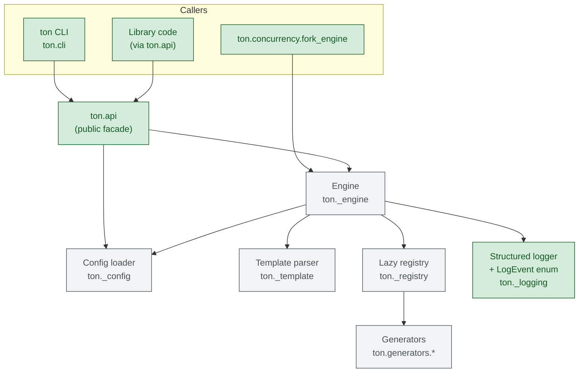
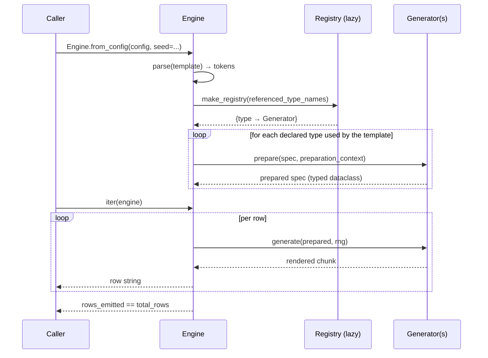

# TON

> Mass data generator: synthesize structured test data from a JSON template.

TON renders rows of structured text from a small JSON description. It is useful when you need a few million lines of plausible-looking CSV, TSV, log records, or fixtures and you do not want to glue together a one-off Python script every time.

## Install

```bash
pip install -e .
```

Python 3.10 or newer. TON has zero runtime dependencies.

## Run without installing

TON has no third-party runtime requirements, so from a checkout you can invoke it straight from the repo root:

```bash
# from the repo root, no pip install needed
python -m ton examples/hwmetrics.json
```

The current directory is on `sys.path` automatically, so Python finds the `ton/` package without `pip install`. Run from somewhere else by pointing `PYTHONPATH` at the checkout:

```bash
PYTHONPATH=/path/to/ton python -m ton /path/to/config.json
```

Every flag described below works the same way in module form.

## Usage

```bash
ton examples/hwmetrics.json
```

Pin the RNG for reproducible output:

```bash
ton examples/hwmetrics.json --seed 42
```

Stream to a file (avoids buffering in your shell):

```bash
ton examples/hwmetrics.json -o hwmetrics.csv
```

### Flags

| flag                   | description                                                                          |
|------------------------|--------------------------------------------------------------------------------------|
| `--seed <int>`         | Seed the RNG for reproducible output.                                                |
| `-o`, `--output PATH`  | Write rows to a file instead of stdout. Refuses non-regular targets (`/dev/*`, …).   |
| `--no-clobber`         | Fail instead of overwriting an existing `--output` file.                             |
| `--resume-from N`      | Generate and discard the first `N` rows before writing output (paired with `--seed`). |
| `--validate`           | Validate the config and exit without generating rows.                                |
| `--batch-rows N`       | Flush output every N written rows (default `1024`).                                  |
| `--progress N`         | Emit a JSON progress line on stderr every `N` rows (also surfaces a logger event).   |
| `--verbose`            | Print final row count, elapsed time, and rows/sec to stderr.                         |
| `--log-level LEVEL`    | Attach a stderr handler to the `ton` logger (`debug`/`info`/`warning`/`error`/`critical`). |
| `--proof-check MODE`   | Proof-check generated values: `off`, `sample`, `all`, or `audit` (collect, don't abort). |
| `--proof-sample-rate N`| With `--proof-check sample`, check every `N`th generated row.                        |
| `--list-namespaces`    | List available namespaces, data types, transforms, and validators, then exit.        |
| `--entry-points`       | Load trusted third-party plugins from the `ton.generators`, `ton.transforms`, and `ton.validators` entry-point groups. |
| `--entry-point NAME`   | Allow only this trusted entry-point name; repeat for multiple names.                 |
| `--version`            | Print the package version.                                                           |

With `--proof-check audit` the run still exits `0`; the failure count is printed to stderr (`ton: proof-check audit: …`) and each failing row is emitted as a `proof_check_failed` log event (see `--log-level warning`).

Everything observability-related goes to stderr; stdout stays clean for piping. Exit codes: `0` success, `1` missing config / output error / refused special-file target, `2` invalid config or unknown variable, `3` unexpected error, `130` interrupted (Ctrl-C).

### Resume / partition a long run

```bash
ton huge.json --seed 1 --resume-from 0       -o chunk-0.txt --batch-rows 4096
ton huge.json --seed 1 --resume-from 500000  -o chunk-1.txt --batch-rows 4096
ton huge.json --seed 1 --resume-from 1000000 -o chunk-2.txt --batch-rows 4096
```

Each shard sees the same seeded RNG; later shards just throw away the prefix they don't want. Combined with `concurrency.fork_engine` (below) this gives deterministic parallel output without coordinating writers.
For large offsets, `--resume-from` still pays the cost of generating skipped rows so every generator reaches the same deterministic state. Prefer explicit worker partitioning with `ton.concurrency.fork_engine` when startup time matters.

## Architecture

For a deeper description of namespaced registrations, transform preparation,
proof checking, and compatibility rules, see [docs/architecture.md](docs/architecture.md).



Row-generation request flow:



Key pieces:

- **`ton.api`** is the only stable public surface. Everything with a single leading underscore (`ton._engine`, `ton._template`, `ton._registry`, `ton._config`, `ton._logging`) is private and may change between releases.
- **`Engine`** owns the row hot path. Template tokens are precomputed into literal segments at construction time, so each row is a string-join with no per-row regex work.
- **`Registry`** instantiates only the generator classes the template actually references (composite specs are walked recursively to pick up nested types). The set of built-ins is fixed by an explicit allowlist; third parties extend via the `ton.generators` entry-point group.
- **`LogEvent`** is a typed enum (`engine_constructed`, `engine_progress`, `entry_point_failed`, …) so downstream consumers can `match LogEvent(record.event)` instead of string-comparing.

## Library use

```python
from ton import api

# One-shot, deterministic:
rows = list(api.generate_from_file("examples/dna.json", seed=42))

# Streaming form for large outputs:
for row in api.generate(config_dict, seed=42):
    sink.write(row)

# Exceptions, Engine, and the LogEvent enum are all re-exported:
try:
    rows = list(api.generate(bad_config))
except (api.ConfigError, api.TemplateError) as exc:
    ...
```

For finer control, construct an `Engine` directly:

```python
from ton import api

engine = api.Engine.from_file("examples/dna.json", seed=42)
print(engine.total_rows, engine.rows_emitted)   # 10, 0
for row in engine:
    ...
print(engine.rows_emitted)                       # 10

# Or with an in-memory config + custom registry / milestone:
engine = api.Engine.from_config(
    config_dict,
    seed=42,
    milestone_rows=100_000,   # emits engine_milestone log events
)
```

An `Engine` is single-shot: iterate it once, then construct a new Engine for
another pass. This gives the RNG, proof checker, and stateful generators such
as `sequence` one unambiguous lifecycle. Calling `api.generate(...)` again
constructs a fresh Engine and reproduces seeded output.

Custom plugins register via three entry-point groups in any installed package: `ton.generators` (data types), `ton.transforms`, and `ton.validators`:

Generator extensions implement `prepare(spec, context=None)`. Composite generators
resolve children with `context.prepare_child(parent_type, location, child_spec)` and
declare nested references with `nested_types(spec)`. The legacy one-argument
`prepare(spec)` contract remains supported for existing plugins.

```toml
[project.entry-points."ton.generators"]
my_type = "my_pkg.generators:MyGenerator"

[project.entry-points."ton.transforms"]
my_ns.my_transform = "my_pkg.transforms:MyTransform"
```

`build_extension_catalog` is the canonical loading API; it returns a namespaced `ExtensionCatalog` exposing `generators()`, `transforms()`, and `validators()`:

```python
catalog = api.build_extension_catalog(include_entry_points=True)
for row in api.generate(config_dict,
                        registry=catalog.generators(),
                        transforms=catalog.transforms()):
    ...
```

`ExtensionCatalog` treats registered generator instances as prototypes. Each
`catalog.generators()` call returns fresh deep-copied instances, so reusing a
catalog across Engines does not share generator state. Generator attributes
must therefore support `copy.deepcopy`.

A broken plugin is isolated: load failures are logged as `entry_point_failed` and skipped; one bad package never aborts the whole catalog build.
Entry points execute installed package code while loading, so TON loads them only when explicitly requested, either through `api.build_extension_catalog(include_entry_points=True)` or the CLI `--entry-points` / `--entry-point NAME` flags. (`api.build_registry` remains as a deprecated generator-only shim.)

Parallel runs use `ton.concurrency`:

```python
from ton import api, concurrency

config = api.load_config("examples/dna.json")
eng = concurrency.fork_engine(
    config, parent_seed=42, worker_id=0, rows=1_000_000
)
for row in eng:
    ...
```

Each worker derives its RNG from `BLAKE2b(parent_seed, worker_id)` so adjacent workers do not see correlated streams. An `engine_forked` log event is emitted with `worker_id` / `parent_seed` so multi-process runs stay distinguishable in the structured log stream.

## Config format

```json
{
  "encoding": "UTF-8",
  "rows": 10,
  "format": "$timestamp$;$cpu_type$;$cpu_usage$",
  "types": {
    "timestamp": {"type": "date",    "minValue": "1100-01-01", "maxValue": "2050-12-31", "format": "%Y-%m-%d %H:%M:%S"},
    "cpu_type":  {"type": "string",  "values": ["AMD", "Intel", "ARM"]},
    "cpu_usage": {"type": "decimal", "minValue": 0.0, "maxValue": 100.0, "decimals": 2, "padWithZero": false}
  }
}
```

- `rows` — how many rows to emit (non-negative integer, maximum `1,000,000,000`).
- `format` — the template; any `$name$` segment is a variable that must be declared in `types`. `$$` renders a literal `$`. A trailing `[id]` (e.g. `$word[id]$`) requests the paired-id facet of a paired generator — see [Paired references](#paired-references-nameid) below.
- `types` — a map of variable name to type spec.
- `encoding` — optional; the text codec used when writing to an `--output` file (default `utf-8`). Must be a codec Python recognizes. Output to stdout uses the stream's own encoding.
- A value that the configured codec cannot represent is an output error (CLI exit `1`), not a configuration error.

Unknown root keys and unknown keys owned by built-in generators/transforms are
rejected, including inside nested composite specs. Diagnostics include the full
config path and a suggestion for close typos. Plugin generators keep an open
key namespace unless they declare `config_keys`; existing plugin-specific
options therefore remain compatible.

### Type reference

Twenty-three built-in types. Every output below was produced with `--seed 1` on a 4-row config of the form `{"rows": 4, "format": "$x$", "types": {"x": <spec>}}` so the examples are byte-reproducible.

#### `boolean`

Pick one of two literals with equal probability.

| field        | type   | description              |
|--------------|--------|--------------------------|
| `whenTrue`   | string | rendered when "true"     |
| `whenFalse`  | string | rendered when "false"    |

```json
{"type": "boolean", "whenTrue": "Y", "whenFalse": "N"}
```

```
Y
Y
N
Y
```

#### `integer`

Uniform integer in `[minValue, maxValue]`, optionally zero-padded. Padding width spans the wider of the min/max rendering (so negative values line up with positives).

| field         | type    | description                           |
|---------------|---------|---------------------------------------|
| `minValue`    | int     | inclusive lower bound                 |
| `maxValue`    | int     | inclusive upper bound (>= `minValue`) |
| `padWithZero` | bool    | left-pad to a fixed width             |

```json
{"type": "integer", "minValue": 1, "maxValue": 9999, "padWithZero": true}
```

```
2202
9326
1034
4180
```

Unpadded with negatives:

```json
{"type": "integer", "minValue": -100, "maxValue": 100, "padWithZero": false}
```

```
-66
45
95
-84
```

#### `decimal`

Uniform float in `[minValue, maxValue]`, rounded and formatted to exactly `decimals` digits after the decimal point.

| field         | type    | description                                  |
|---------------|---------|----------------------------------------------|
| `minValue`    | number  | inclusive lower bound                        |
| `maxValue`    | number  | inclusive upper bound (>= `minValue`)        |
| `decimals`    | int     | digits after the decimal point (>= 0)        |
| `padWithZero` | bool    | left-pad to a fixed width including sign + dot |

```json
{"type": "decimal", "minValue": 0.0, "maxValue": 100.0, "decimals": 2, "padWithZero": false}
```

```
13.44
84.74
76.38
25.51
```

#### `char`

Concatenate `maxChar` random picks from `values` (with replacement).

| field      | type      | description                              |
|------------|-----------|------------------------------------------|
| `values`   | string[]  | non-empty alphabet                       |
| `maxChar`  | int       | output length (1 ≤ N ≤ `MAX_CHAR_LENGTH`) |

```json
{"type": "char", "values": ["A", "C", "G", "T"], "maxChar": 6}
```

```
CAGATT
TTCATA
TTATGC
AGAAAA
```

#### `string`

Pick one literal uniformly from `values`.

| field    | type     | description           |
|----------|----------|-----------------------|
| `values` | string[] | non-empty literal pool |

```json
{"type": "string", "values": ["Intel", "AMD", "ARM"]}
```

```
Intel
ARM
Intel
AMD
```

#### `weighted`

Pick one alternative with probability proportional to its weight. Three shapes are accepted. Weights are **optional in every shape** — omit them and the generator falls back to uniform sampling (1/N per entry).

**Parallel arrays** (string values, legacy):

| field     | type           | description                                          |
|-----------|----------------|------------------------------------------------------|
| `values`  | string[]       | non-empty literal pool                               |
| `weights` | number[]       | optional; same length as `values`, non-negative      |

```json
{"type": "weighted", "values": ["Intel", "AMD", "ARM"], "weights": [90, 8, 2]}
```

```
Intel
Intel
Intel
Intel
```

(Skew toward `Intel` matches the 90/8/2 weighting.)

**Record form** — `values: [{"value": "...", "weight": N}, ...]` is the same thing with a less error-prone layout.

**Composite form** — any registered generator can be weighted, not just literal strings:

| field     | type     | description                                                       |
|-----------|----------|-------------------------------------------------------------------|
| `choices` | object[] | each entry is `{"weight": number?, "spec": <type spec>}` — `weight` defaults to `1.0` (uniform) when omitted |

```json
{"type": "weighted",
 "choices": [
   {"weight": 70, "spec": {"type": "string", "values": ["common"]}},
   {"weight": 30, "spec": {"type": "integer", "minValue": 0,
                            "maxValue": 99, "padWithZero": false}}
 ]}
```

```
common
common
60
common
```

Composite `choices` may themselves nest `weighted` / `oneOf` / `sequence_of`. Paired generators (`hash`, `lmhash`) cannot be used as a composite child — the `[id]` half would be unreachable from outside the wrapper, so the engine rejects such configs at construction time.

#### Transform chains

Type specs may include an ordered `transforms` list. Legacy specs such as
`{"type": "integer"}` still work; built-ins can also be referenced with the
explicit `core.` namespace, for example `{"type": "core.integer"}`.

Type specs may also include a `validators` list of validator references.
Validators run after source generation and transforms. The built-in
`non_empty` validator rejects empty strings; plugins may add namespaced
validators such as `plugin.check`:

```json
{"type": "string", "values": ["ok"], "validators": ["non_empty"]}
```

The built-in `distribution` transform chooses among two or more prepared
candidate type specs:

```json
{
  "type": "string",
  "values": ["ignored"],
  "transforms": [
    {
      "type": "distribution",
      "choices": [
        {"weight": 80, "spec": {"type": "string", "values": ["common"]}},
        {"weight": 20, "spec": {"type": "integer", "minValue": 1, "maxValue": 9}}
      ]
    }
  ]
}
```

The built-in `identity` transform is an explicit no-op. It returns generated
values unchanged and preserves paired values, so it is mainly useful when a
config or test needs a transform step without changing output.

Plugins register namespaced data types and transforms through the public
catalog API or trusted entry points. A plugin-provided type can be referenced
with its qualified name:

```json
{"type": "acme.customer_id", "prefix": "CUST"}
```

Load installed plugin entry points explicitly:

```bash
ton config.json --entry-points --list-namespaces
```

Proof checking can validate generated values during a run:

```bash
ton config.json --proof-check sample --proof-sample-rate 1000
ton config.json --proof-check all
ton config.json --proof-check audit
```

Strict modes (`sample` and `all`) stop on the first proof failure with row,
field, stage, and reason. Audit mode keeps generating rows and records proof
failures for library callers via `Engine.proof_failures`.

#### `oneOf`

Pick uniformly between several nested type specs. Same as `weighted` with equal weights, just less typing.

| field     | type     | description                                |
|-----------|----------|--------------------------------------------|
| `choices` | object[] | each entry is itself a full type spec      |

```json
{"type": "oneOf",
 "choices": [
   {"type": "string", "values": ["alpha"]},
   {"type": "string", "values": ["beta"]},
   {"type": "integer", "minValue": 0, "maxValue": 9, "padWithZero": false}
 ]}
```

```
alpha
beta
beta
beta
```

#### `sequence_of`

Concatenate `count` independent draws from a single child spec, joined by an optional separator. Handy for compound identifiers that don't fit cleanly into the `regex` quantifier surface.

| field       | type   | description                                              |
|-------------|--------|----------------------------------------------------------|
| `count`     | int    | draws per row (1 ≤ N ≤ `MAX_SEQUENCE_OF_COUNT`)          |
| `separator` | string | inserted between draws (default empty)                   |
| `spec`      | object | child type spec                                          |

```json
{"type": "sequence_of",
 "count": 4,
 "separator": "-",
 "spec": {"type": "integer", "minValue": 0, "maxValue": 9, "padWithZero": false}}
```

```
2-9-1-4
1-7-7-7
6-3-1-7
0-6-6-9
```

#### `date`

Uniform calendar datetime between ISO-8601 bounds, formatted with `strftime`.

| field       | type   | description                                       |
|-------------|--------|---------------------------------------------------|
| `minValue`  | string | ISO 8601 (date or datetime), inclusive            |
| `maxValue`  | string | ISO 8601 (date or datetime), inclusive            |
| `format`    | string | `strftime` format (default `%Y-%m-%d %H:%M:%S`)   |

```json
{"type": "date", "minValue": "2024-01-01", "maxValue": "2024-12-31", "format": "%Y-%m-%d %H:%M:%S"}
```

```
2024-02-22 04:21:55
2024-08-09 01:21:52
2024-11-25 02:39:17
2024-11-07 13:39:08
```

#### `timestamp_unix`

Same bounds semantics as `date` but emits epoch seconds (or millis).

| field       | type   | description                                  |
|-------------|--------|----------------------------------------------|
| `minValue`  | string | ISO 8601 (date or datetime), inclusive       |
| `maxValue`  | string | ISO 8601 (date or datetime), inclusive       |
| `unit`      | string | `seconds` (default) or `millis`              |

`millis` uses the same whole-second draw as `seconds` and multiplies by
`1000`, so generated millisecond values always end in `000`.

```json
{"type": "timestamp_unix", "minValue": "2024-01-01", "maxValue": "2024-12-31", "unit": "seconds"}
```

```
1708575715
1723166512
1732502357
1730986748
```

#### `uuid`

UUID4 (default) or UUID1. UUID4 is built from the seeded RNG, so it is reproducible; UUID1 uses the host clock + node id and ignores the seed.

| field        | type | description                          |
|--------------|------|--------------------------------------|
| `version`    | int  | `1` or `4` (default `4`)             |
| `uppercase`  | bool | upper-case the hex (default `false`) |

```json
{"type": "uuid", "version": 4}
```

```
f5b16522-4a58-4791-9f6a-f1d8303e61cd
c4bb86c3-d1c4-4710-bc34-4c4189eb2f1e
7bd5d47e-446f-4ec2-a3d8-11736110e578
1bcccea6-9676-4e61-96c6-e9c92d99bf35
```

#### `sequence`

Monotonic counter, useful for primary keys / row ids. State lives on the prepared spec, so each Engine instance has its own counter. Not thread-safe: construct one Engine per worker / thread (see `ton.concurrency.fork_engine`).

| field      | type | description                       |
|------------|------|-----------------------------------|
| `start`    | int  | first value (default `0`)         |
| `step`     | int  | non-zero increment (default `1`)  |
| `padWidth` | int  | zero-pad to this width (`0` off, maximum `100,000`) |

```json
{"type": "sequence", "start": 1000, "step": 1}
```

```
1000
1001
1002
1003
```

#### `bytes`

Random bytes encoded for transport.

| field      | type   | description                                 |
|------------|--------|---------------------------------------------|
| `length`   | int    | raw byte count (1 ≤ N ≤ `MAX_BYTES_LENGTH`) |
| `encoding` | string | `hex` (default), `base64`, or `base32`      |

```json
{"type": "bytes", "length": 8, "encoding": "hex"}
```

```
f5b165224a58b791
df6af1d8303e61cd
c4bb86c3d1c42710
3c344c4189eb2f1e
```

```json
{"type": "bytes", "length": 16, "encoding": "base64"}
```

```
9bFlIkpYt5HfavHYMD5hzQ==
xLuGw9HEJxA8NExBiesvHg==
e9XUfkRvzsKj2BFzYRDleA==
G8zOppZ2LmEWxunJLZm/NQ==
```

#### `ipv4` / `ipv6`

Random IP inside a CIDR block.

| field   | type   | description                                  |
|---------|--------|----------------------------------------------|
| `cidr`  | string | CIDR (defaults `0.0.0.0/0` or `::/0`)        |

```json
{"type": "ipv4", "cidr": "10.0.0.0/16"}
```

```
10.0.68.203
10.0.32.79
10.0.130.152
10.0.60.95
```

```json
{"type": "ipv6", "cidr": "2001:db8::/32"}
```

```
2001:db8:414c:343c:1027:c4d1:c386:bbc4
2001:db8:7311:d8a3:c2ce:6f44:7ed4:d57b
2001:db8:c9e9:c616:612e:7696:a6ce:cc1b
2001:db8:f1fd:42a2:9755:d4c1:3a90:2931
```

#### `mac`

48-bit MAC address, optionally with a fixed 24-bit OUI prefix.

| field        | type   | description                                |
|--------------|--------|--------------------------------------------|
| `separator`  | string | single char between octets (default `:`)   |
| `uppercase`  | bool   | upper-case the hex (default `false`)       |
| `oui`        | string | 24-bit prefix (`00:1A:2B`, `00-1A-2B`, …)  |

```json
{"type": "mac", "oui": "00:1A:2B"}
```

```
00:1a:2b:b1:65:22
00:1a:2b:58:b7:91
00:1a:2b:6a:f1:d8
00:1a:2b:3e:61:cd
```

#### `name`

Random person name from built-in given/family pools.

| field   | type   | description                            |
|---------|--------|----------------------------------------|
| `style` | string | `full` (default), `given`, or `family` |

```json
{"type": "name", "style": "full"}
```

```
Dara Silva
Bobby Ito
Chen Patel
Omar Patel
```

#### `email`

`<given>.<family>@<domain>`, lowercased.

| field     | type     | description                                                              |
|-----------|----------|--------------------------------------------------------------------------|
| `domains` | string[] | optional override; default is `example.com / .org / .net / test.invalid` |

```json
{"type": "email"}
```

```
dara.silva@example.com
ines.davila@test.invalid
omar.patel@test.invalid
felix.davila@test.invalid
```

#### `phone`

Replace every `#` in `format` with a random decimal digit.

| field    | type   | description                                               |
|----------|--------|-----------------------------------------------------------|
| `format` | string | pattern with `#` placeholders (must include at least one) |

```json
{"type": "phone", "format": "+1 (###) ###-####"}
```

```
+1 (291) 417-7763
+1 (170) 669-0743
+1 (915) 000-8063
+1 (608) 377-8353
```

#### `text`

Lorem-style words, sentences, or paragraphs (single-line output, safe inside CSV).

| field   | type   | description                                          |
|---------|--------|------------------------------------------------------|
| `unit`  | string | `words` (default), `sentences`, or `paragraphs`      |
| `count` | int    | how many units (1 ≤ N ≤ `MAX_TEXT_COUNT`)            |

```json
{"type": "text", "unit": "words", "count": 6}
```

```
sed irure qui proident occaecat amet
dolore elit ea occaecat nisi ex
esse nostrud non ut adipiscing ea
ipsum mollit culpa nostrud laboris reprehenderit
```

#### `regex`

Produce strings matching a user-supplied regex. Supports literals, character classes, escapes (`\d \w \s` and their negations), quantifiers, alternation, and groups. Unbounded `*` / `+` add at most 8 repeats, literal `{N}` quantifiers are capped at 10,000, total nested expansion is capped at 1,000,000 characters per row, and group nesting is capped at 100.

| field     | type   | description                       |
|-----------|--------|-----------------------------------|
| `pattern` | string | non-empty regex                   |

```json
{"type": "regex", "pattern": "[A-Z]{3}-\\d{4}"}
```

```
SZY-4177
UMZ-1706
TYY-7439
KAA-8063
```

#### `hash` (paired)

Generic byte-oriented digest drawn from a fixed plaintext list. **Paired**: a single row may reference both the digest (`$word$`) and the plaintext (`$word[id]$`). `lmhash` remains separate because it is the Windows NT-hash specialty.

| field       | type     | description                                          |
|-------------|----------|------------------------------------------------------|
| `algorithm` | string   | `md5`, `sha1`, `sha256` (default), `sha512`, or `bcrypt` |
| `values`    | string[] | non-empty plaintext pool                            |

`bcrypt` requires the optional `ton[bcrypt]` extra and accepts `rounds` from `4` to `12` (default `12`). TON derives a stable bcrypt salt from the plaintext so synthetic fixtures remain reproducible.

```json
{
  "rows": 4,
  "format": "$word[id]$ -> $word$",
  "types": {"word": {"type": "hash", "algorithm": "sha256",
                     "values": ["password", "secret", "admin"]}}
}
```

```
password -> 5e884898da28047151d0e56f8dc6292773603d0d6aabbdd62a11ef721d1542d8
admin -> 8c6976e5b5410415bde908bd4dee15dfb167a9c873fc4bb8a81f6f2ab448a918
password -> 5e884898da28047151d0e56f8dc6292773603d0d6aabbdd62a11ef721d1542d8
secret -> 2bb80d537b1da3e38bd30361aa855686bde0eacd7162fef6a25fe97bf527a25b
```

#### `lmhash` (paired)

Canonical Windows NT hash (MD4 of UTF-16LE plaintext) drawn from a fixed word list. **Paired**: a single row may reference both the hash (`$word$`) and the plaintext that produced it (`$word[id]$`). Intentionally insecure — use only for synthetic credential fixtures.

| field    | type     | description                |
|----------|----------|----------------------------|
| `values` | string[] | non-empty plaintext pool   |

```json
{
  "rows": 4,
  "format": "$word[id]$ -> $word$",
  "types": {"word": {"type": "lmhash", "values": ["password", "secret", "admin"]}}
}
```

```
password -> 8846f7eaee8fb117ad06bdd830b7586c
admin -> 209c6174da490caeb422f3fa5a7ae634
password -> 8846f7eaee8fb117ad06bdd830b7586c
secret -> 878d8014606cda29677a44efa1353fc7
```

### Paired references (`$name[id]$`)

Any **paired** generator (currently `hash` and `lmhash`; third parties can opt in via `PairedGenerator`) returns a `(id_value, primary_value)` tuple per row. The template engine routes:

- `$name$` → `primary_value`
- `$name[id]$` → `id_value`

The two facets stay consistent within a single row, so a single plaintext is shown alongside its own hash. Paired generators cannot be used as children of a composite generator (`weighted`, `oneOf`, `sequence_of`) — the `[id]` half would be unreachable from outside the wrapper, so the engine rejects such configs at construction time.

## Observability

Library code emits structured INFO events on a single logger named `ton`. Attach a handler the usual way (`logging.getLogger("ton")`) or pass `--log-level` on the CLI to get a stderr handler for free. The event identifier lives in `record.event` and matches a value from the `api.LogEvent` enum:

| event                                 | when                                                |
|---------------------------------------|-----------------------------------------------------|
| `engine_constructed`                  | Engine built, rows/types/paired-flag known          |
| `engine_milestone`                    | every `milestone_rows` rows during iteration        |
| `engine_progress`                     | CLI progress tick (also emitted as JSON on stderr)  |
| `engine_completed`                    | iterator exhausted                                  |
| `engine_forked`                       | `fork_engine` produced a worker Engine              |
| `prepare_failed` / `generate_failed`  | a Generator raised during prepare / generate        |
| `transform_prepared`                  | a field's transform was prepared at construction    |
| `config_validated`                    | `validate_config` passed catalog-aware checks       |
| `proof_check_failed`                  | a value failed its proof check (per-row detail)     |
| `proof_check_summary`                 | end-of-run proof summary (`mode`, `failures`)       |
| `registry_discovered`                 | built-in registry built (once per process)          |
| `plugin_registered`                   | a namespaced plugin was registered in the catalog   |
| `entry_point_loaded`                  | third-party plugin instantiated                     |
| `entry_point_failed`                  | third-party plugin raised on load — entry skipped   |
| `entry_points_summary`                | per-process summary of loaded / failed entries      |
| `output_overwrite`                    | `-o` file existed and was truncated                 |
| `output_special_file_rejected`        | `-o` target was not a regular file or FIFO          |
| `resume_overshoot`                    | `--resume-from` exceeded `total_rows`               |
| `cli_unexpected_error`                | CLI top-level catch-all (traceback in handler)      |

## Safety notes

- `-o PATH` refuses to open a target that is not a regular file or FIFO. A stray `--output /dev/sda` aborts with exit code `1` and an `output_special_file_rejected` log event.
- `--no-clobber` upgrades the silent overwrite to a hard refusal.
- Regular `-o PATH` writes are staged through a same-directory temp file and atomically replace the final path only after generation succeeds. FIFO targets remain direct streams.
- Third-party generators from the `ton.generators` entry-point group are opt-in and sandboxed per-entry: `ImportError`, construction failures, and non-`Generator` factories are logged and skipped instead of aborting the registry build. Entry point names and values are sanitized to printable ASCII before being logged (control codes / unicode lookalikes become `?`).
- `lmhash` uses MD4 by design (it is the canonical NT-hash). Treat its output as fixture data, never as a credential.

## Bundled example configs

- [`examples/hwmetrics.json`](examples/hwmetrics.json) — timestamped CPU telemetry.
- [`examples/dna.json`](examples/dna.json) — SNP records (`rsID`, chromosome, position, genotype).
- [`examples/winhash.json`](examples/winhash.json) — NT-hash rainbow-table seed.

## Development

```bash
python -m venv .venv && source .venv/bin/activate
pip install -e ".[dev]"
pytest                              # 500+ tests, 100% line coverage enforced
pytest -m fuzz --no-cov             # seeded fuzz/property suites only
ruff check ton tests
mypy ton tests                      # strict mode is on
```

Enable the pre-commit gate once per clone so the CI lint + typecheck jobs
(`ruff check`, `ruff format --check`, `mypy ton`, `pyright ton`) run before
every commit and block it on failure:

```bash
git config core.hooksPath .githooks
```

Bypass in an emergency with `git commit --no-verify`.

Behavior guidelines for AI agents live in [`AGENTS.md`](AGENTS.md); open review findings are tracked in [`TODO.md`](TODO.md).

## License

[BSD 3-Clause](LICENSE)
