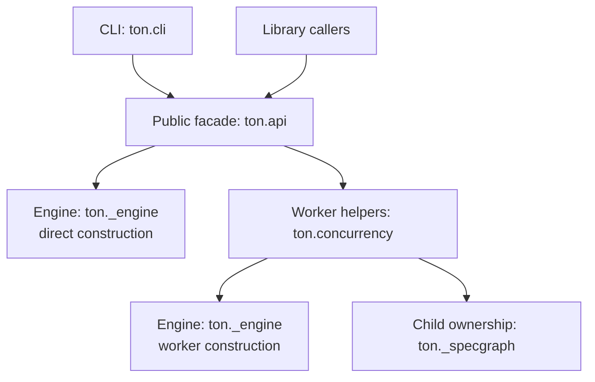
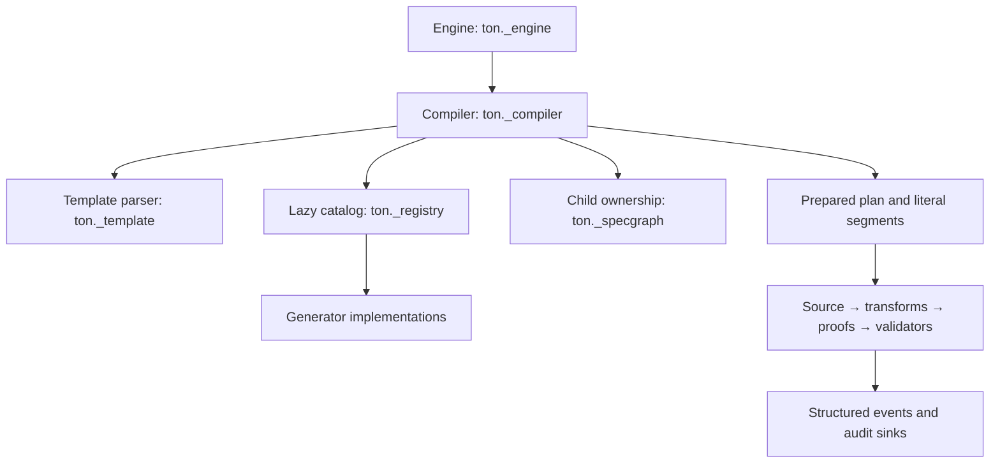
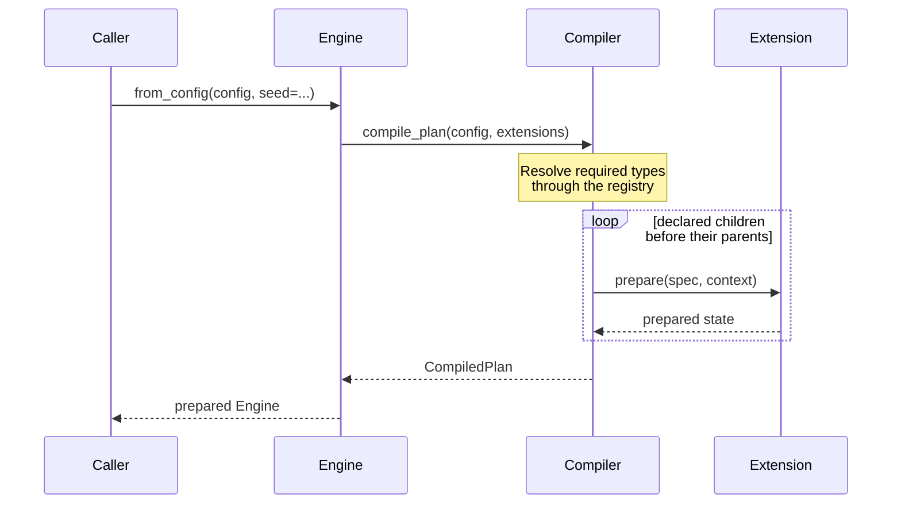
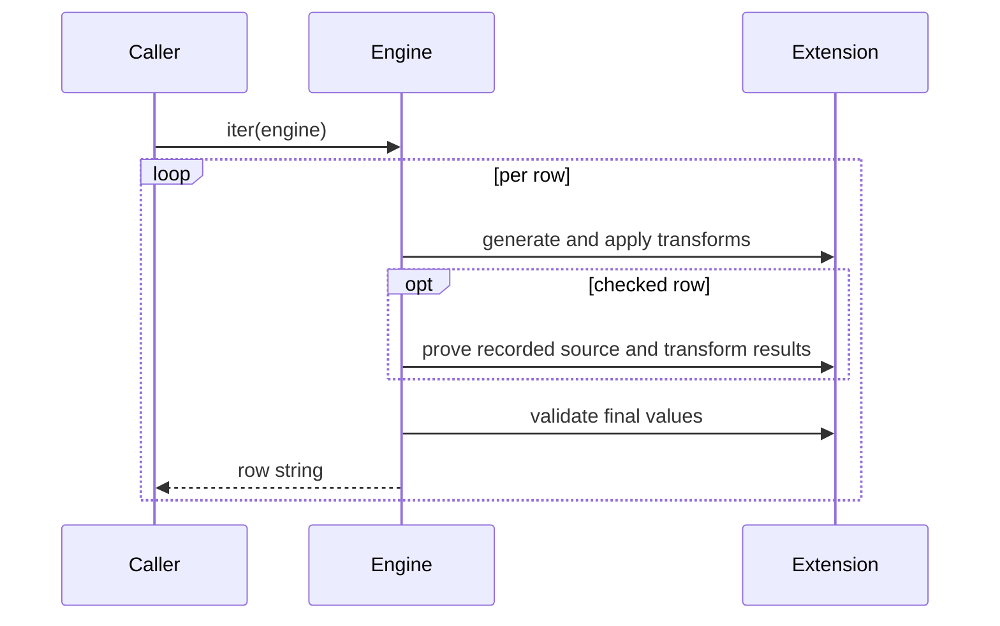

# TON architecture

[Documentation](README.md) · [Project overview](../README.md)

TON separates configuration, compilation, extension ownership, row generation,
and proof checking. Public contracts support plugins without exposing those
implementation modules.

## Public surface

`ton.api` is the stable library facade. It exports `Engine`, `EngineOptions`,
generator and transform contracts, catalog builders, errors and output helpers.
The worker helpers in `ton.concurrency` are also re-exported through `ton.api`.
Modules with a leading underscore are private and may change between releases.
See [library use](library.md) and [extension authoring](extensions.md).

## Compilation and execution

### Entry points and worker setup

Both Engine boxes refer to the same implementation. The separate branches show
direct construction and construction through a worker helper.

### Compilation and row pipeline

The compiler and worker helpers use the same child-ownership service. The two
views keep their connections local to each phase.

The diagrams show responsibilities and data flow. Construction validates the
configuration, snapshots extension state, parses placeholders, discovers required
types and prepares field pipelines. `EngineCompiler` builds a `CompiledPlan` with
resolved fields and literal segments. Rendering joins those segments and drawn
values without parsing the template again.

The default registry instantiates only the generator classes referenced by the
template and their declared children. Built-ins come from an explicit class
catalog. Generator classes declare their own supported configuration keys.
Catalog-aware `validate_config` additionally prepares unused declared fields so
validation covers the whole configuration.

### Engine construction

### Row generation

The prepared Engine runs the row pipeline without involving the compiler or
registry in each draw.

An Engine is single-shot. It owns its RNG, prepared generator state, proof state
and iteration lock. Paired sources are drawn once per field per row; repeated
references reuse that pair. Simple fields retain a direct source-generation path
when proof checking is off. [Configuration](configuration.md#row-width) documents
the optional operator-controlled row-width guard.

## Dependency boundaries

| Module | Responsibility |
|---|---|
| `ton._contracts` | Generator, paired-generator and preparation contracts |
| `ton._references` | Namespaced reference parsing and resolution |
| `ton._scalars` | Scalar parsing and formatting without generator imports |
| `ton._specgraph` | Shared child ownership for compilation and worker partitioning |
| `ton._proof` | Prepared pipeline records, transform traces and proof result types |
| `ton._pipeline` | Shared transform execution and exact child draw traces |
| `ton._steps` | Explicit work-stack dispatch and originating-hook errors |
| `ton._composite` | Public cooperative composite adapter |
| `ton._validation` | Validator execution and deferred child checks |
| `ton._proofcheck` | Proof sampling, failure collection, sinks and diagnostics |

Contracts and reference resolution do not import catalogs, concrete generators
or the compiler. Scalar helpers let JSON decoding and CLI integer handling work
without loading generator implementations.

## Ownership and preparation

Built-ins use the `core` namespace; a bare name such as `integer` resolves to
`core.integer`. Plugins use qualified references. Catalog prototypes and supplied
extension mappings are copied for each Engine. A catalog snapshot copies all
three extension kinds together, preserving aliases and shared dependencies within
that snapshot. Internal validation, CLI and worker builders transfer their private
snapshot into compilation without copying it again; public inputs remain isolated
prototypes. The [catalog ownership contract](extensions.md#catalogs-and-instance-ownership)
explains how to share configuration while keeping runtime state independent.

The compiler prepares declared children before their parents using an explicit
work stack. `nested_specs` declares literal child locations; arbitrary plugin
metadata remains opaque. Cyclic ownership is rejected with its configuration
path. Traversal paths share their parent components and format complete diagnostic
strings only when needed. Generation snapshots only referenced fields; full
validation also visits unused fields. Compilation and worker partitioning use the
same ownership records from `ton._specgraph`, with different traversal policies:
preparation includes declared
source children, while workers traverse only children that actually execute when
a transform replaces the source.

Worker partitioning calls the optional `Partitionable.partition(spec, offset)`
capability on generators and transforms. `PartitionSpec` carries owner-setting
updates and child offsets. This supports custom multiplicities and stateful
extensions without concrete generator checks in the traversal. Both worker
helpers consume `EngineOptions`; [worker options](concurrency.md#worker-options)
and [partition hooks](extensions.md#worker-partitioning) define their ownership
and serialization rules.

## Pipeline ordering and traces

For each field, generation runs in this order:

1. Generate the source, unless the first transform replaces it.
2. Apply transforms in order, recording before/after values on checked rows.
3. Prove the source and transforms when the proof mode selects the row.
4. Validate nested and root final values.

Root and child pipelines share prepared stage records and transform execution.
On checked rows, child validators are deferred until the enclosing field has
been proved. Strict proof failure aborts before validation; audit mode records
failures and continues to validators. Unchecked rows validate immediately.
The row scope is restored on failure, interruption and reentrant Engine calls.

Built-in composites and public `CompositeGenerator` plugins use explicit work
stacks for generation and proof, without changing Python's recursion limit.
Traces retain only the child draws that actually ran, with their original values
and prepared owners. Parent formatting does not change the values passed to
child proof hooks. The executor preserves the originating hook on failures.
Internal traces share unchanged string payloads across nested operations. Public
generator calls return strings carrying the trace needed for standalone proof.
Leaf transform hooks run directly; composite transforms retain stack dispatch.

Transforms declare whether they accept paired input, preserve pairing or replace
the source; incompatible chains are rejected during preparation. The
[transform authoring contract](extensions.md#transforms) and
[proof guide](proofs.md) describe the public behavior and audit record format.

## Observability

`LogEvent` is a typed enum exposed by `ton.api`; consumers can use
`LogEvent(record.event)` to interpret structured events. Event definitions live
in the [logging guide](observability.md). Provenance records describe each
field's source, transform chain, proof settings and plugin provider. Audit sinks
receive every proof failure; retained in-memory failures are a bounded sample.
